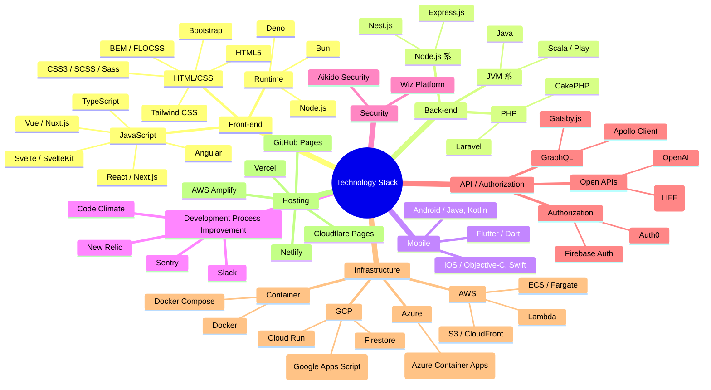

---
# Feel free to add content and custom Front Matter to this file.
# To modify the layout, see https://jekyllrb.com/docs/themes/#overriding-theme-defaults

layout: default
title: 職務経歴トップ
stylesheet: ./src/main.css
body_class: markdown-body
pdf_options:
  format: A4
  margin: 25mm 20mm
---

# 職務経歴書

**最終更新日：2025 年 12 月 28 日**

---

## 👤 基本情報

| 項目 | 内容 |
|------|------|
| **氏名** | 北村 勇磨（きたむら ゆうま） |
| **Profile** | https://yuma-kitamura.nekohack.me/ |
| **Blog** | https://blog.nekohack.me/ |
| **GitHub** | https://github.com/jiyuujin |
| **X** | https://x.com/jiyuujinlab |
| **YOUTRUST** | https://youtrust.jp/users/yuukit |
| **Wantedly** | https://www.wantedly.com/users/101311859 |
| **connpass** | https://connpass.com/user/jiyuujin/ |
| **Slides** | https://slides.com/jiyuujin |

---

## 💪 長所・強み

- **幅広い技術領域への理解と関心**
  - エンジニアリングにとどまらず、設計・デザイン領域にも踏み込んだ理解を持つ
  - マネジメント分野にも主体的に関心を持ち、組織全体の改善に貢献

- **業務・開発環境改善への強いコミットメント**
  - チーム内外を巻き込んだ、業務プロセス全体の最適化を推進
  - ボトルネックの発見と解消に向けた継続的な改善
    - Slack ワークフロー等を活用したDevOps改善
    - Google Apps Script による業務効率化
    - Markdown / VuePress を用いたドキュメント基盤の整備

- **技術コミュニティへの積極的な関与**
  - 他者の技術や知見を柔軟に取り入れる姿勢
  - カンファレンスへの参加および、個人スポンサーとしての協賛活動

---

## 🛠 技術スキル

### 📊 技術レベル一覧

| カテゴリ | 技術 | 習熟度 | 実務経験 |
|---------|------|--------|---------|
| **フロントエンド** | React / Next.js | ⭐⭐⭐⭐⭐ | 5 年以上 |
| | Vue / Nuxt.js | ⭐⭐⭐⭐⭐ | 8 年以上 |
| | TypeScript | ⭐⭐⭐⭐⭐ | 5 年以上 |
| | Svelte / SvelteKit | ⭐⭐⭐ | 3 年以上 |
| **バックエンド** | Node.js / Express | ⭐⭐⭐⭐⭐ | 3 年以上 |
| | PHP / Laravel | ⭐⭐⭐⭐ | 5 年以上 |
| | Scala / Play | ⭐⭐⭐ | 3 年以上 |
| **モバイル** | Flutter | ⭐⭐⭐⭐ | 6 年以上 |
| | iOS / Swift | ⭐⭐⭐ | 4 年以上 |
| | Android / Kotlin | ⭐⭐⭐ | 2 年以上 |
| **インフラ** | AWS | ⭐⭐⭐ | 6 年以上 |
| | Azure | ⭐⭐ | 1 年以上 |
| | Docker | ⭐⭐⭐⭐ | 4 年以上 |
| | GCP | ⭐⭐⭐ | 4 年以上 |
| **開発環境** | VS Code | ⭐⭐⭐⭐ | 6 年以上 |
| | IntelliJ IDEA | ⭐⭐⭐ | 6 年以上 |
| | Vim | ⭐⭐⭐⭐ | 8 年以上 |
| | Figma | ⭐⭐⭐ | 6 年以上 |

---

### 🎤 技術領域の強み

| 領域 | 習熟度・関心 | 本業との関連 |
|---------|--------|---------|
| フロントエンド | ⭐⭐⭐⭐⭐ | 副業・制作経験が豊富 |
| 設計・構成 | ⭐⭐⭐⭐ | 思考の軸。最も楽しさを感じる部分 |
| バックエンド | ⭐⭐⭐⭐ | 現在の主戦場。実務能力が高い |
| SRE / インフラ | ⭐⭐ | 基礎知識はあるが、専業ではない |

**強み**: バックエンド + フロントエンド（Web）+ アーキテクチャ設計を得意とするフルスタック型。
**特徴**: SRE より開発寄り、アプリケーション全体の構成設計が好き。

---

### 📚 現在の学習テーマ

BOTCHAN プロダクトにおける DevOps 推進と並行して、個人プロジェクトでも研鑽を重ねています。

**2025 年の主な取り組み**
- 個人ブログのデザインを継続的に改善
- AI 利活用に向けた実践的な探究

**継続的な学習領域**
- AI
- デザインシステム
- DevOps
- セキュリティ（XSS、SRI 等）
- サーバーサイド（Nest.js や Scala）
- API 設計（GraphQL）

---

## ✍️ 寄稿・登壇実績

### 寄稿

#### SOFTWARE DESIGN（技術評論社） 2022 年 10 月号
VS Code の「Git & GitHub 連携で役立つ機能」を執筆。VS Code Meetup オーガナイザーのご縁により初の商業誌執筆を実現。

### 主な登壇（直近 3 年間）

#### React で LIFF アプリを作ろう（設計重視編） / 2023.05.17
中級者以上を対象に、React のカスタムフックを使用した LIFF アプリ開発のハンズオンを開催・執筆・登壇。

#### PWA Night #40 / 2022.06.15
Google I/O 2022 と WWDC 2022 の Recap として、両イベントの振り返りを発表。

#### React (Vite) で LIFF アプリを作ろう / 2022.03.03
初学者向けに LINE front-end framework（LIFF）を React 上で使用するハンズオンを開催・執筆・登壇。

#### VS Code Conference JP 2021 プレイベント / 2021.11.01
VS Code Meetup 史上初の公式ウェブサイト製作に携わった取り組みについて発表。

#### ジャムジャム Jamstack #2 / 2021.10.28
コロナ禍の間、毎朝 X Spaces（旧 Twitter Spaces）で技術情報を共有し続けた「オハヨーエンジニア」。
本発表では、その日々の対話を GitHub Issues を CMS として整理・保存し、ウェブサイトとして公開するまでの設計思想と実装の工夫を紹介。

#### DevRel Online #3 / 2021.04.12
Flutter 日本ユーザグループ（Flutter Osaka）におけるオンラインハンズオンの取り組みを紹介。

---

## 🌟 OSS 活動

### FlutterKaigi 関連

Flutter 専門のテックカンファレンス FlutterKaigi において、ティザーサイトのリードを担当。2022 年まで設計・実装を担当させていただき、リードさせてもらいました。

**技術スタック**
- Flutter
- GitHub Pages
- Firebase Hosting（プレビュー用）
- Codemagic Static Pages（プレビュー用）

### Vue Fes Japan 関連

Vue Fes Japan 2022 に続き、2023 年の開催に向けてティザーサイトのリードを担当。2019 年の台風による中止を経験し、技術コミュニティの運営者として貢献したいという想いからコアスタッフに参加。

**技術スタック**
- Nuxt.js (SSG)
- Netlify

### VS Code Conference JP 関連

2021 年、VS Code Conference JP 史上初のティザーサイトの設計・実装を担当。複数年のモノレポ化にも取り組み、共通コンポーネント化を推進。

**技術スタック**
- Next.js (SSG)
- GitHub Pages

### LINE Developers 関連

LINE Developers コミュニティ主催の技術カンファレンス Rev Up 2022 のティザーサイトを製作。LINE front-end framework を活用し、ウェブサイト内での LINE ログイン機能を実現。

**技術スタック**
- SvelteKit (SSG)
- Netlify

---

## 🎯 プライベートワーク

### Yuma Kitamura - Web Developer

個人ブログと分離する形で 2020 年 3 月に個人サイトの運営を開始。2022 年春にモノレポ化移行と Next.js へのリプレースを実施。技術カンファレンスのオーガナイズ活動において、自己紹介の場として活用。

**技術スタック**
- Next.js (SSG)
- AWS S3 + CloudFront

### 個人ブログ

2018 年 10 月より運営開始。2023 年春に Nuxt 製から Lume 製へリプレース。初登壇の内容を文字情報に書き起こしたことがきっかけで開始し、毎月最低 1 本の技術記事を発信することを心がけている。

**技術スタック**
- Lume (SSG)
- Cloudflare Pages
- GitHub Pages（かつてプレビュー用に使用）
- Zenn ライクな執筆体験を実現
- 自身を気軽に応援してもらえるよう Stripe 決済も開設

---

## 💼 職務経歴

### 株式会社 wevnal（2023 年 10 月 〜 現在）

| 項目 | 内容 |
|------|------|
| **職種** | サービス開発エンジニア（フロントエンド・サーバサイド） |
| **雇用形態** | 正社員 |
| **事業内容** | ボット配信サービス BOTCHAN の開発・提供 |
| **従業員数** | 約 150 名 |

**チーム構成**
- プロダクトマネージャー：1 名
- サービス開発エンジニア：4 名（本人含む）
- デザイナー：1 名
- インフラエンジニア：1 名

#### BOTCHAN Payment プロジェクト

TBD

### 株式会社ブイキューブ（2021 年 6 月 〜 2023 年 9 月）

| 項目 | 内容 |
|------|------|
| **職種** | サービス開発エンジニア（フロントエンド・サーバサイド） |
| **雇用形態** | 正社員 |
| **事業内容** | イベントライブ配信サービス EventIn の開発・提供 |
| **従業員数** | 約 400 名 |

**チーム構成**
- プロダクトマネージャー：1 名
- サービス開発エンジニア：10 名（本人含む）
- デザイナー：1 名
- インフラエンジニア：1 名

#### EventIn プロジェクト

**主な業務・成果**

- **交流施策**
  - 繋がり機能の設計・開発

- **DX改善施策**
  - Vite 導入によるビルド高速化の実現
  - バリデーションエラー表示の拡充
  - コンポーネント設計の全面的な見直し
  - 型定義の開発方針策定

---

### スマレジ株式会社（2019年7月 〜 2021年5月）

| 項目 | 内容 |
|------|------|
| **職種** | フロントエンドエンジニア |
| **雇用形態** | 正社員 |
| **事業内容** | 販売支援プラットフォーム スマレジ POS の開発・提供 |
| **従業員数** | 約 100 名 |

**チーム構成**
- プロダクトマネージャー：1 名
- フロントエンドエンジニア：1 名（本人）
- サーバーサイドエンジニア：3 名
- インフラエンジニア：1 名

#### フロントエンドチーム設立

リードエンジニアとして横断的なフロントエンドチーム（最大 5 名）を立ち上げ。

**主な取り組み**
- コーディングガイド、スタイルガイド、ユニットテスト手引きの策定
- 社内共通コンポーネントプラグインの制作

#### セルフオーダー用ウェブサイトプロジェクト

**セルフオーダー施策**
- 機能追加におけるデザイン設計と実装を担当
- PWA アプリとしてタブレット端末の表示に最適化
- SRE エンジニアとして AWS Lambda と API Gateway を使用した Push 通知・Post API の設計・開発
- インフラチームとの協働によるテスト実施

#### POS フロントエンド刷新プロジェクト

**UX 改善施策**
- リプレースにおけるデザイン設計と実装
  - 複数店舗選択モーダル
  - 日付範囲抽出コンポーネント

**パフォーマンス改善**
- ブロッキングレンダリングの軽減（CSS / JS サイズ削減）

**API 仕様書策定**
- Web API の Swagger ドキュメント作成
- API 名・フィールド名の整合性検証テスト作成

**既存フロントエンドの基盤整理**
- クロスブラウザ対応の実装

---

### 株式会社 ROXX、旧 SCOUTER（2019 年 2 月 〜 2019 年 6 月）

| 項目 | 内容 |
|------|------|
| **職種** | サーバサイドエンジニア・フロントエンドエンジニア |
| **雇用形態** | 正社員 |
| **事業内容** | 求人プラットフォーム AGENT BANK（旧 SARDINE）の開発・提供 |
| **従業員数** | 約 50 名 |

**チーム構成**
- プロダクトマネージャー：1 名
- フロントエンドエンジニア：2 名（本人含む）
- サーバーサイドエンジニア：3 名（本人含む）
- インフラエンジニア：1 名

#### AGENT BANK プロジェクト

**主な業務**
- タイムライン・メンション機能のリプレースにおけるデザイン設計と実装
- 必須入力機能の実装
- スクラム開発プロセスの実践
- ミートアップ・カンファレンスでの知見発信

---

### ポノス株式会社（2016 年 1 月 〜 2019 年 1 月）

| 項目 | 内容 |
|------|------|
| **職種** | サーバサイドエンジニア・フロントエンドエンジニア |
| **雇用形態** | 正社員 |
| **事業内容** | ソーシャルゲーム「にゃんこ大戦争」「なめすた」の開発・提供 |
| **従業員数** | 約 100 名 |

**チーム構成**
- プロジェクトマネージャー：1 名（本人兼務）
- フロントエンドエンジニア：1 名（本人）
- サーバーサイドエンジニア：3 名（本人含む）
- インフラエンジニア：1 名

#### にゃんこ大戦争 自社内管理画面の開発

**主な業務**
- 自社内管理画面の全面リプレース
- 京都市営地下鉄コラボイベント管理機能（AWS Lambda + Node.js）
- GAS 連携によるイベント管理・マスタ管理
- クリーンアーキテクチャに基づく設計・実装

#### なめすた 自社内管理画面、ゲーム内ブラウザの開発

**主な業務**
- 自社内管理画面の開発
  - お知らせ、アイテム付与、ガチャ、マスタ、イベント管理
- ゲーム内ブラウザの開発
- クリーンアーキテクチャに基づく緻密なコンポーネント設計

---

### 株式会社システナ（2014 年 10 月 〜 2015 年 12 月）

| 項目 | 内容 |
|------|------|
| **職種** | iOS エンジニア |
| **雇用形態** | 正社員 |
| **事業内容** | iOS アプリケーション制作 |
| **従業員数** | 約 2,500 名 |

**チーム構成**
- プロジェクトマネージャー：1 名
- iOS エンジニア：3 名（本人含む）
- Android エンジニア：3 名
- サーバーサイドエンジニア：2 名

#### リモート視聴アプリ開発

**主な業務**
- クライアント要望の改善提案からデザイン業務まで一貫して担当
- パレンタル制御の設計・実装
- お気に入り機能の設計・実装
- 運用指導と迅速なサポート対応

---

### Minori ソリューションズ株式会社（2012 年 4 月 〜 2014 年 9 月）

| 項目 | 内容 |
|------|------|
| **職種** | iOS エンジニア |
| **雇用形態** | 正社員 |
| **事業内容** | 業務系アプリケーション・iOS アプリケーション開発 |
| **従業員数** | 約 1,000 名 |

**チーム構成**
- プロジェクトリーダー：1 名
- サブリーダー：1 名
- iOS エンジニア / 業務開発エンジニア：6 名（本人含む）

#### 勤怠管理アプリケーション開発

**新規開発**
- プロトタイプ開発を含むアプリの設計・実装を一貫して担当
- データベーススキーマの提案とレビュー（5 名のエンジニアと協働）

**既存システム改善**
- 管理画面の UX 改善を担当
- この経験からフロントエンド改善に興味を持ち、Web エンジニアへの転向を決意

#### 受発注管理アプリケーション開発（.NET）

**主な業務**
- ウォーターフォール開発における設計・実装
- ユニットテスト・結合テストの実施

---

## 📞 お問い合わせ

各種 SNS の DM またはプロフィールサイト経由でお気軽にご連絡ください。
※ 最近 X は見ていないため、Bluesky やプロフィールサイト経由でご連絡いただけると助かります。
